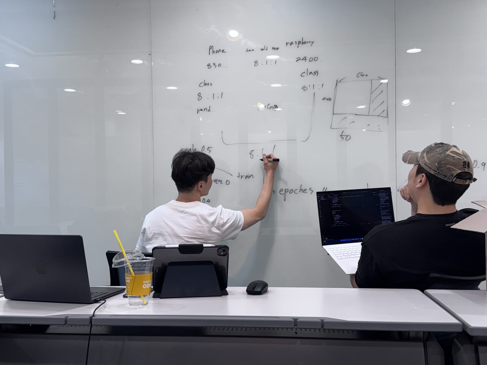
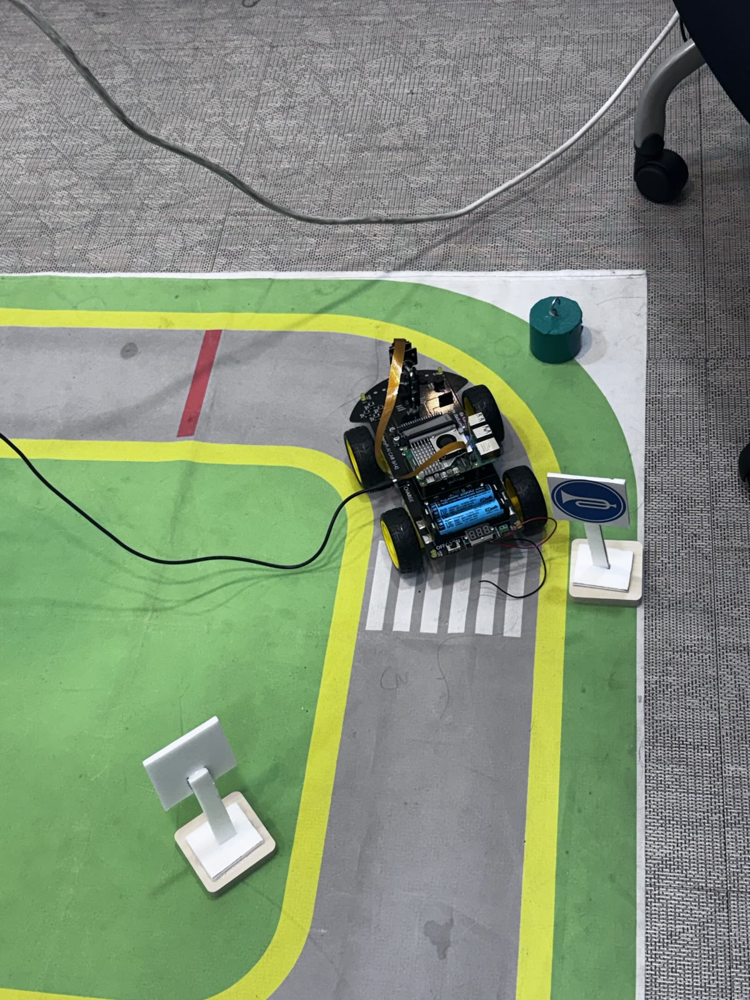
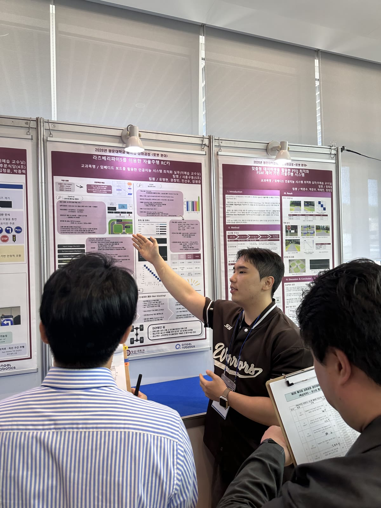
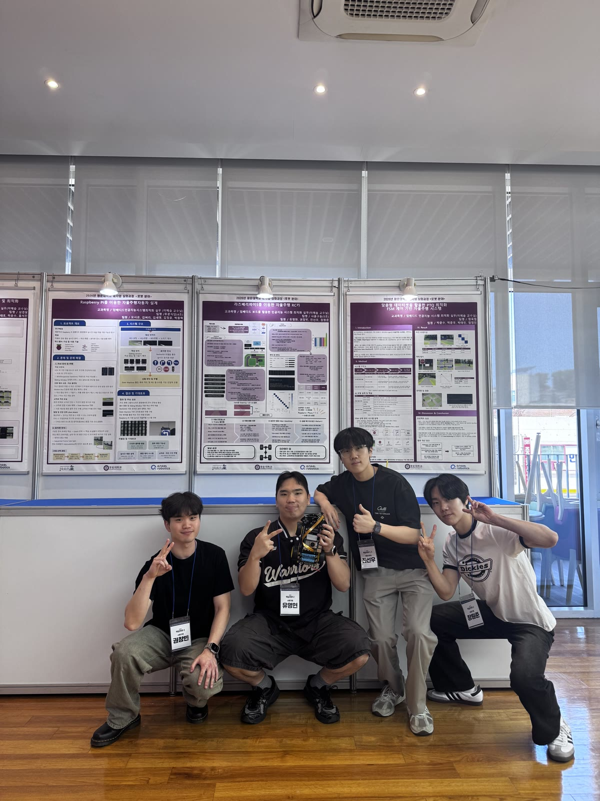
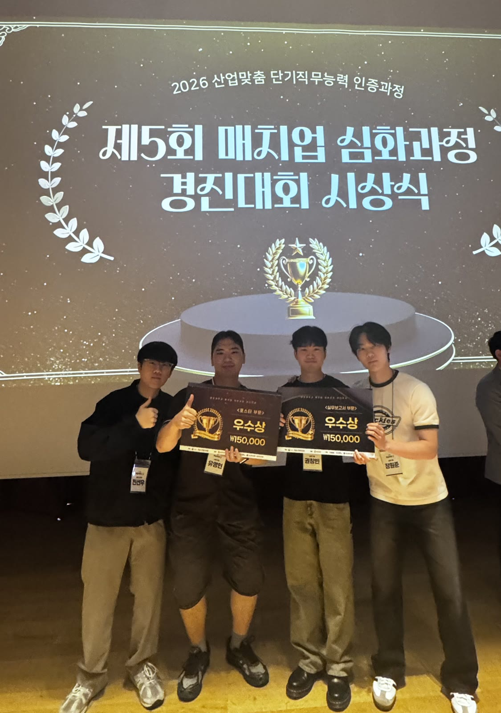
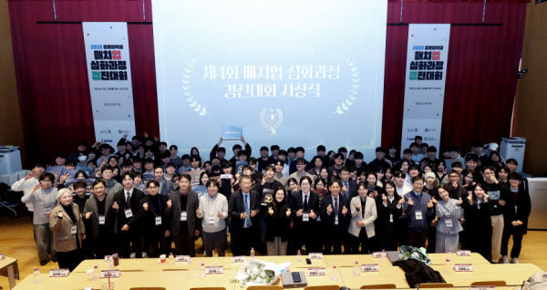

# 4WD_4wheelguys
광운대학교 임베디드인공지능시스템 최적화 Project, "사륜구동" 팀입니다.

## 🔧 프로젝트 요약
표지판·신호등 인식 기반 자율주행 RC카를 5인 팀으로 개발했습니다.

- **인식 모델**: YOLOv11n 기반 표지판/신호등 인식
- **엣지 최적화**: ONNX→TFLite INT8 양자화로 라즈베리파이5 실시간 구동 확보 (75%↓, mAP 0.95, 30FPS)
- **주행 제어**: Conditional Imitation Learning 기반 조향 모델과 인식 결과 결합

## 🏆 성과
포스터·실무보고서 부문 우수상 (매치업 심화과정 시상식)

## 🎬 데모 영상
...(기존 내용 이어짐)

 

## 🎬 데모 영상

라즈베리파이 기반 자율주행 RC카의 트랙 주행 데모입니다. 표지판, 신호등과 같은 외부 환경요소를 잘 인식해 미션을 수행하며 안정적으로 주행하는 모습입니다.
아래 영상을 클릭하면 재생됩니다.

https://github.com/user-attachments/assets/5201b997-aafb-4de9-93ed-3cc123f96539

## 📸 프로젝트 갤러리

<table>
  <tr>
    <td width="33%" align="center"> 설계 · 학습 전략 회의</td>
    <td width="33%" align="center"> 자율주행 트랙 주행</td>
    <td width="33%" align="center"> 포스터 발표 심사</td>
  </tr>
  <tr>
    <td width="33%" align="center"> 팀 사륜구동</td>
    <td width="33%" align="center"> 우수상 수상 (포스터 · 실무보고서 부문)</td>
    <td width="33%" align="center"> 매치업 심화과정 시상식</td>
  </tr>
</table>
